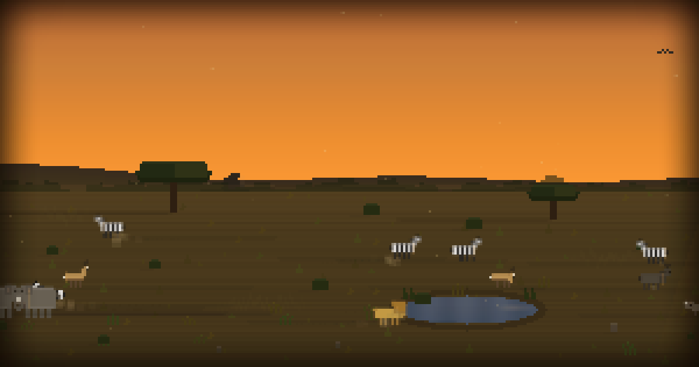

# Savannah

Pixel-art African savanna screensaver with ecosystem simulation.

[](https://africa.morgaes.is/?t=17.5&seed=7742)

**[Live demo](https://africa.morgaes.is)** · [Blog post](https://morgaes.is/blog/african-savanna-screensaver)

## Features

Eight animal species (zebra, gazelle, wildebeest, warthog, lion, elephant, giraffe, bird) with coroutine-based AI, individual personalities, and realistic speeds. Lions stalk and chase; prey flees with alarm propagation through the herd. Vultures circle kills.

Full day/night cycle with Milky Way, moon, Southern Cross, shooting stars, morning mist, crepuscular sun rays, distant lightning, fireflies, dust devils, and procedural audio (wind, crickets, birdsong via Web Audio API).

Ground texture and decoration placed via PCG-hashed jittered grid (stratified sampling). Spatial hash grid for O(n) collision avoidance. Render loop decoupled from logic at 30 tps.

## Run locally

```
bun install
bun run src/server.ts
```

Open http://localhost:4680

## Static build

```
bash build.sh     # outputs to dist/
npx serve dist    # or any static host
```

## Query params

| Param | Description | Example |
|-------|-------------|---------|
| `t` | Time of day (hours, 0-24) | `?t=17.5` (sunset) |
| `seed` | World seed (deterministic layout) | `?seed=7742` |
| `speed` | Day length in seconds | `?speed=300` (5 min days) |
| `vp` | Viewport x position | `?vp=400` |
| `w` | World width (min 400) | `?w=1200` |
| `animals` | Animal counts (letter+number, comma-separated) | `?animals=z10,g8,l3,e5` |
| `pause` | Freeze time at specified `t` value | `?t=17.5&pause` |
| `hide` | Hide all UI (clean mode for screenshots/embedding) | `?hide` |

## Controls

- **Click** — fullscreen
- **Drag** / **arrow keys** — pan viewport
- **N** — skip to next time period
- **S** — cycle day speed (1x / 60x / 300x)
- **[cfg]** button — settings panel (animal counts, world width, reset)
- **Minimap** — click to pan
- **Time dial** — drag to set time (circular, wraps at midnight)

## License

MIT
